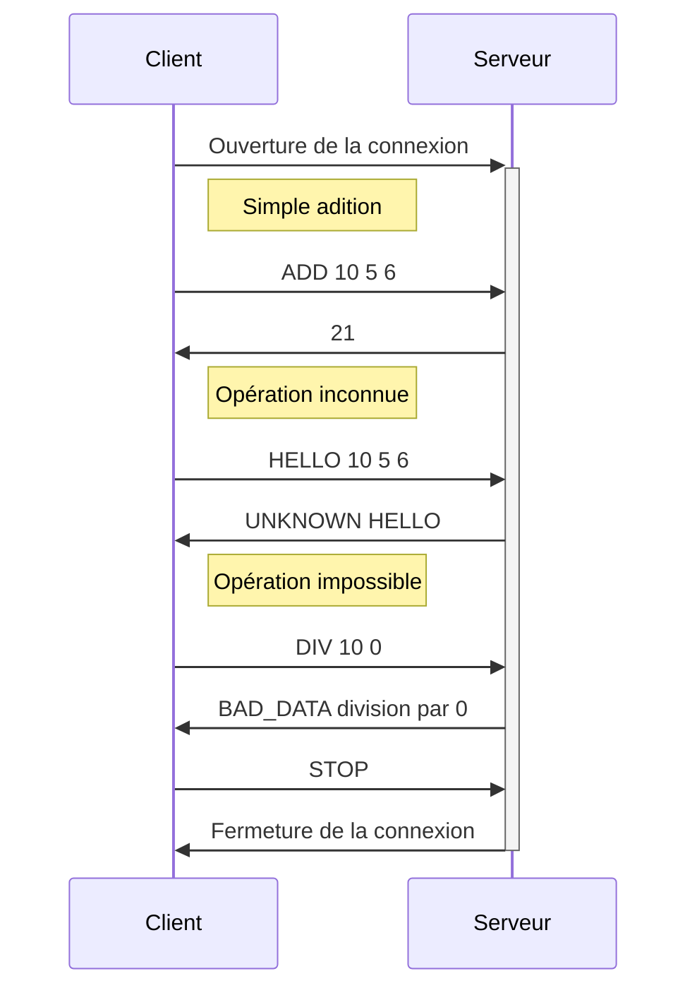

# Protocole

## Overview
1. Protocole client-serveur.
2. Le client se connecte au serveur.
3. Le client demande au serveur d'effectuer une opération sur des nombres entiers.
4. Le serveur répond avec :
   * le résultat de l'opération ou 
   * un message d'erreur si l'opération demandée n'existe pas ou 
   * un message d'erreur si l'opération est impossible avec les données entrées. 
5. Le client peut continuer à faire des demandes tant qu'il le souhaite (les étapes 3 et 4 
   peuvent s'enchaîner en boucle autant de fois que nécessaire).
6. Le client envoie un message pour signifier qu'il a terminé ses demandes.
7. Le serveur romp la connection.

## Transport layer protocol
Le procotole utilise TCP. C'est le client qui établi la connection. Il connaît l'adresse IP du 
serveur, qui écoute sur le port 1234. C'est le serveur qui termine la connexion lorsque le client 
lui envoie qu'il a terminé.

## Messages
Les messages de l'application sont :
* `<OP> <num1> <num2> ...` : Le client demande à effectuer une opération, où `<OP>` est le nom 
  d'une opération (`ADD`, `SUB`, `MUL`, ...) et `<num1> <num2> ...` est une liste de nombres 
  entiers sur laquelle il faut effectuer l'opération.
* `STOP` : Le client déclare qu'il n'a plus d'opération à faire.
* `UNKNOWN <operation>` : Message d'erreur si le client demande une opération que le serveur ne 
  connaît pas.
* `BAD_DATA <message>` : Message d'erreur si les nombres donnés ne permettent pas d'effectuer 
  l'opération demandée (pas assez de nombres, division par 0, ...) avec un message d'explication.

Les messages sont encodés en UTF-8 avec \n comme fin de ligne. Si l'opération existe et est 
possible, le serveur envoie le résultat sous forme textuelle en UTF-8.

## Dialogue exemple

